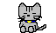

 
  <!--   -->
  
   Hello and welcome
     
      <pre> 
        💼 UNCC @ Computer Science • Programming • Cybersecurity focus 
        💻 Java • Python • Lua • HTML/CSS • Bash basics 
        📖 Data structures • OOP • Problem solving • System fundamentals 
        🛠️ Hardware repair • Soldering • Troubleshooting 
        🎮 games • anime • music • code
      </pre> 
      
      <!--  -->
    

   
  <a href="https://octo-ring.com/p/HiMyNamesSeb/prev"><--</a>
  <a href="https://octo-ring.com/">octo-ring</a>
  <a href="https://octo-ring.com/p/HiMyNamesSeb/random">🎲</a>
  <a href="https://octo-ring.com/p/HiMyNamesSeb/next">--></a>

